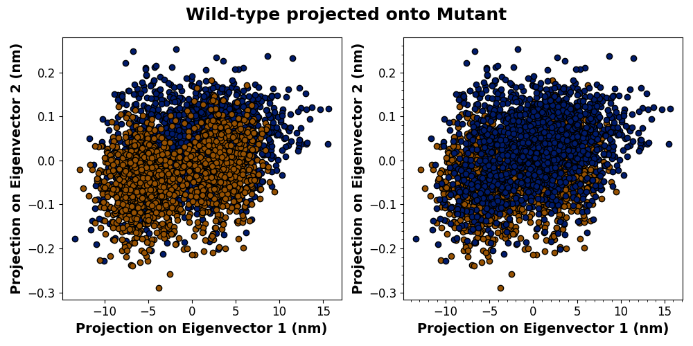
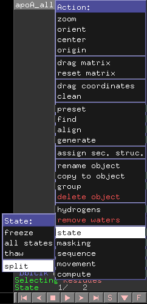
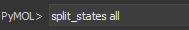
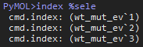
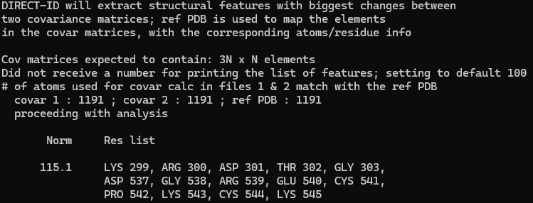

# Principal Component Analysis (PCA)

## Introduction

Principal component analysis (PCA) allows us to identify major changes in conformation and movement after MD simulation.

This guide assumes you have *all files in the same directory*. If not, be sure to reference each file from their respective directories – though it will be much easier later if all files are in the same directory.

Small systems will be able to do the initial set-up, `gmx covar`, and `gmx anaeig` within the same interactive session. If you have very large/complex systems you wish to compare, you may need to submit a slurm job to run these commands.

Interactive sessions allow us to use an allocation of ARC to actively submit commands, rather than queueing a job and waiting.

To begin an interactive session of 2 hours:

```bash
interact -p v100_dev_q -A bevanlab --gres=gpu:1 --nodes=1 --ntasks-per-node=12 -t 2:00:00
```

Then import the necessary modules (copy and paste *individual* lines to the command line):

```bash
module load apps site/infer/easybuild/setup
module load CMake/3.15.3-GCCcore-8.3.0
module load CUDA/10.1.243-GCC-8.3.0
 
export MODULEPATH=$MODULEPATH:/projects/bevanlab/software/infer/modules/modules/infer-skylake/all
module load gromacs-v100/2020.4
```

## Initial set-up

You should have the following files from your MD simulations:

* Final trajectory files (.xtc) for all replicates
* Topology file (.tpr) from any replicate

### Concatenate trajectory files

All trajectory (.xtc) replicates must be concatenated, or joined together, in order to analyze the average motion of your system.

!!! note
    You **MUST** use the `-cat` option, otherwise duplicate timeframes will be overwritten by the last XTC file used.

```
gmx trjcat -f rep1.xtc rep2.xtc rep3.xtc -cat -o all_cat.xtc
```

### Get backbone-only trajectory (.xtc)

Since covariance analysis is performed on the protein backbone, you will need to generate an xtc trajectory file containing the protein backbone only.

To generate a backbone-only XTC file:

```
gmx trjconv -s topology.tpr -f all_cat.xtc -o all_cat_backbone.xtc
```

Select backbone when prompted.

### Get backbone-only topology file (.tpr)

The topology (.tpr) and trajectory (.xtc) files MUST match in atom count, otherwise you will get a fatal error when trying to run `gmx covar`.

To guarantee a match, create a backbone-only TPR file:

```
gmx convert-tpr -s topology.tpr -o backbone.tpr
```

Select backbone when prompted. It does not matter which TPR file is used (whether replicate 1 or 3), as `gmx covar` will only be referencing the structural information.

## Covariance analysis

You need the new concatenated backbone-only XTC and TPR files generated in the initial set-up to perform covariance analysis. Because this step generates many files, it is advisable to make a new directory (e.g., `covar/`) to store your outputs.

To perform covariance analysis:

```
gmx covar -f all_cat_backbone.xtc -s backbone.tpr -o ./covar/eigenval.xvg -ascii ./covar/ascii.dat -av ./covar/ave.pdb -v ./covar/eigenvec.trr
```

Select backbone when prompted.

This produces the following outputs:

* `-o`: eigenvalues of the covariance matrix
* `-ascii`: the whole covariance matrix, in text form
* `-av`: the average structure
* `-v`: the full precision trajectory

Repeat this for all systems. Be sure to use a clear naming convention, as this data will be projected onto each other in the next step.

## Analysis of eigenvectors

In order to analyze changes in motion during simulation, the outputs from the previous step must be processed using `gmx anaeig`.

The following files are needed for every system you plan to compare:

* `backbone.xtc`
* `eigenval.xvg`
* `ave.pdb`
* `eigenvect.trr`

To perform eigenvector analysis:

```bash
# Project MUT onto WT
gmx anaeig -s wt_ave.pdb -f mut_backbone.xtc -v wt_eigenvec.trr -eig wt_eigenval.xvg -proj mut_wt_proj-ev.xvg -extr mut_wt_ev.pdb -2d mut_wt_eigtraj.xvg 

# Project WT onto MUT
gmx anaeig -s mut_ave.pdb -f wt_backbone.xtc -v mut_eigenvec.trr -eig mut_eigenval.xvg -proj wt_mut_proj-ev.xvg -extr wt_mut_ev.pdb -2d wt_mut_eigtraj.xvg
```

Select backbone, protein, or system when prompted (these are all the same).

This produces the following outputs:

* `-proj`: the projections of trajectories on the first and last eigenvectors
* `-extr`: the two extreme projections along the average structure
* `-2d`: 2D projection of trajectories on the eigenvectors

## Data visualization and analysis

### Graphing 2D projections

You will need the `mdpca.py` file to create PCA graphs from the 2D projection data. A version of this file is available (somewhere). You will also need a way to run Python 3 scripts.

The following files are needed for every system you plan to compare:

* `eigtraj.xvg`

All relevant files must be in the same directory as the script OR use a path to the file.

#### Using `mdpca.py`

Open the script in a code editor and configure the following:

1. Under `#2D INPUT FILES`, change file names to match the two `eigtraj.xvg` files.
2. Under `#GRAPH COLORS`, change the hex codes to adjust graph colors.
3. Under `#TITLE AND FILE PARAMETERS`, change the graph title and output file name.
    * The graph title can be styled using Mathtext or LaTeX.
    * By default, graphs are saved as PNG files.

Save and run the script. The output will be two side-by-side projection graphs with a single title:



The degree of overlap between the two datasets represents how structurally similar the systems are during simulation. Overlap in the data suggests these simulations take on more similar structures, or sample similar conformational space. Conversely, regions without overlap indicate differences in conformation.

### Visualizing extreme structures with PyMOL

The conformational changes indicated by the 2D graphs can be visualized by looking at the extreme structures that were generated by `-extr` of `gmx anaeig`. Opening one of these PDB files in PyMOL gives us a protein structure with two frames. Each frame represents the first and last eigenvectors, which are depicted in the 2D graph as the X- and Y-axes, respectively.

If your 2D graphs show any regions without overlap, these two frames should be different when you toggle between them. We can add arrow indicators to show the degree and direction of these differences using `modevectors`.

To do this, you will need the [`modevectors.py` script](https://pymolwiki.org/index.php/Modevectors). You can additionally use the optional `modesplit.py` script, which automates part of this process with a little extra set-up. Place all scripts in the same directory as the PDB files you are working with.

#### Using `modevectors.py`

The `modevectors.py` script requires that the two frames be split into two PyMOL objects. This can be done through the graphical user interface (GUI) or the PyMOL command line.

=== "GUI"
    To do this in the PyMOL GUI, find the object buttons at the right of the program. Navigate to either your protein or the "all" object and click the A icon.

    Navigate to the "state" option, then select "split".
    <figure markdown="span">
    
     </figure>

    This will create 2 new objects, "*protein*_0001" and "*protein*_0002", which correspond to the two frames.
    
    ---

=== "Command line"
    To do this in the PyMOL command line, type `split_states all`.
    <figure markdown="span">
    
    </figure>
    This will create 2 new objects, "*protein*_0001" and "*protein*_0002", which correspond to the two frames.

    ---

You can now use `modevectors.py`! Run each of the following lines individually in the PyMOL command line, replacing the object names as appropriate:

```
run modevectors.py

modevectors first_obj_frame, last_obj_frame, skip=0
```

`skip` indicates how many vectors (arrows) are skipped during rendering. Adjust this if the final render is too visually cluttered.

#### Using `modesplit.py`

Repeatedly running Modevectors can be tedious if you are analyzing multiple systems with the same protein, or multi-subunit systems where you want to analyze each subunit individually. The `modesplit.py` script is an additional (optional) script that can split subunits and automate the above process. It requires some set-up, but afterwards the script can be run as-is for all relevant PDB files.

Open `modesplit.py` in a code editor. Define all protein subunits in the `#CHAINS` dictionary. The dictionary can be modified for any number of subunits, but at least one entry is required to run.

Note that the `start_index` and `end_index` ask for the index of the first and last *atoms* of the subunit, not residues. This is to avoid duplicates with homo-oligomers, which will have the same residue numbers designated across identical subunits.

To find the index of an atom in PyMOL:

 1. Select the first residue of the subunit. In the command line, type `index %sele` and hit enter. PyMOL will return three lines of text. Note the number at the end of the **first** line of the output.
 2. Click off the protein to deselect the residue.
 3. Repeat step 1, instead selecting the last residue of the subunit. Note the number at the end of the **last** line of the output.
 4. Repeat for all subunits.

<figure markdown="span">
  
  <figcaption>Output of the index command.</figcaption>
</figure>

Update the indices, then save the file. Load it into PyMOL using `run modesplit.py` in the command line.

!!! note
    This script will also automatically run `modevectors.py`. You can adjust the parameters for Modevectors in line 47.

### Analyzing motion with DIRECT-ID

DIRECT-ID is a program that identifies residues with the greatest variance in movement between two systems based on the covariance matrices produced by `gmx covar`.

The following files are needed to perform DIRECT-ID analysis:

* `ascii.dat` for both systems of interest
* `ave.pdb` for either system

DIRECT-ID should already be set-up on ARC and can be accessed using the following command:

```bash
direct_id 3NXN wt_ascii.dat mut_ascii.dat wt_ave.pdb direct_id_output.txt
```

Depending on where you are trying to run the analysis, you may need to run the command using a path to the DIRECT-ID program.

```bash
(../)../../direct_id 3NXN wt_ascii.dat mut_ascii.dat wt_ave.pdb direct_id_output.txt
```

Regardless of how the program is run, two outputs will be generated: a text file containing a list of *atoms* with the most variance in movement, and a command line output listing the *residues*.

<figure markdown="span">

</figure>
In most cases, the terminal output is the most relevant. Record or screenshot this output, as it does not get saved in a file. The residues listed should match those with the greatest motion in the Modevectors analysis.

## Additional Resources

* [gmx trjcat](https://manual.gromacs.org/current/onlinehelp/gmx-trjcat.html)
* [gmx trjconv](https://manual.gromacs.org/current/onlinehelp/gmx-trjconv.html)
* [gmx convert-tpr](https://manual.gromacs.org/current/onlinehelp/gmx-convert-tpr.html)
* [gmx covar](https://manual.gromacs.org/current/onlinehelp/gmx-covar.html)
* [gmx anaeig](https://manual.gromacs.org/current/onlinehelp/gmx-anaeig.html)
* [Modevectors](https://pymolwiki.org/index.php/Modevectors)
* [DIRECT-ID](https://onlinelibrary.wiley.com/doi/abs/10.1002/jcc.24231)
