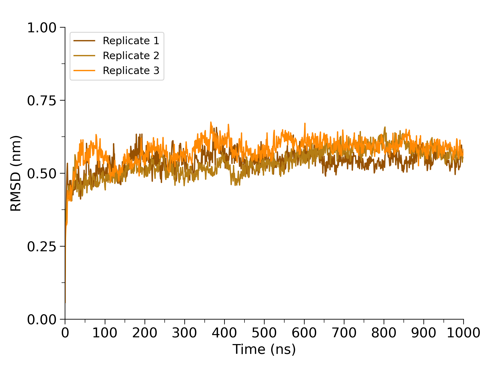

# Root Mean Square Deviation and Fluctuation (RMSD/RMSF)

## Introduction

**Root-mean-square deviation (RMSD)** is a measure of how much a structure differs from a starting or reference structure, usually reported in angstroms (Å) or nanometers (nm). Plotting RMSD against time tells us two things:

1. How much the protein structure has changed since the start of the simulation. Greater RMSD values indicate greater change, and vice versa.
2. Whether our simulation has achieved convergence, or a state of equilibrium.

<figure markdown="span">
  { width="540" }
  <figcaption>RMSD graph from one set of simulations. RMSD is plotted as nanometer (nm) versus time (ns).</figcaption>
</figure>

Similarly, **root-mean-square fluctuation (RMSF)** allows us to identify regions that are highly flexible throughout the simulation. RMSF is plotted as a function of protein residue.

<figure markdown="span">
  { width="540" }
  <figcaption>RMSF graph from the same simulations. RMSF is plotted as nanometer (nm) versus residue number.</figcaption>
</figure>

You should have the following files for RMSD/RMSF:

* Trajectory files (.xtc)
* Topology file (.tpr)
* Index files (.ndx) - OPTIONAL

## RMSD and RMSF analysis in GROMACS

To perform RMSD analysis, use `gmx rms`:

```bash
gmx rms -f trajectory.xtc -s topology.tpr -o rmsd.xvg
```

You will be prompted to select two groups, one for least squares fit and one for the RMSD calculations. Select `Backbone` for both of these.

Some additional options that you may find useful:

* `-n`: index file to be used (see [Creating Index Files](IndexFiles.md))
* `-tu`: specifies time units (default is ps)
* `-b` and `-e`: specifies the frames to <ins>b</ins>egin and <ins>e</ins>nd
* `skip`: number of frames to skip, useful for large simulations

---

To perform RMSF analysis, use `gmx rmsf`:

```bash
gmx rmsf -f trajectory.xtc -s topology.tpr -o rmsf.xvg -res
```

Select `Backbone` when prompted. The `-res` option is required to calculate the average fluctuation for each residue.

Some additional options that you may find useful:

* `-n`: index file to be used (see [Creating Index Files](IndexFiles.md))
* `-b` and `-e`: specifies the frames to <ins>b</ins>egin and <ins>e</ins>nd
* `skip`: number of frames to skip, useful for large simulations

---

## Additional Resources

* [gmx rms](https://manual.gromacs.org/current/onlinehelp/gmx-rms.html)
* [gmx rmsf](https://manual.gromacs.org/current/onlinehelp/gmx-rmsf.html)
