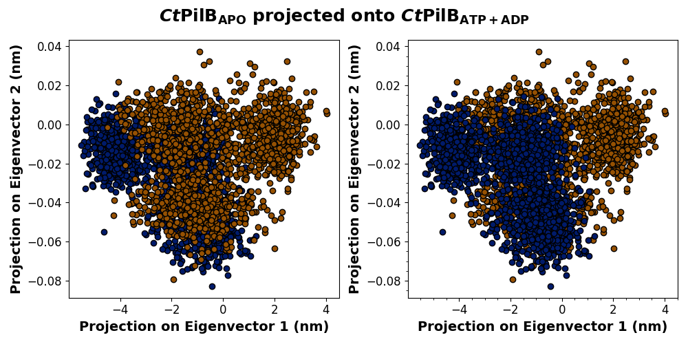

# Principal Component Analysis (PCA)

## Introduction

This guide assumes you have *all files in the same directory*. If not, be sure to reference each file from their respective directories – though it will be much easier later if all files are in the same directory.

Small systems will be able to do the initial set-up, `gmx covar`, and `gmx anaeig` within the same interactive session. If you have very large/complex systems you wish to compare, you may need to submit a slurm job to run these commands.

Interactive sessions allow us to use an allocation of ARC to actively submit commands, rather than queueing a job and waiting.

To begin an interactive session of 2 hours:

```bash
interact -p v100_dev_q -A bevanlab --gres=gpu:1 --nodes=1 --ntasks-per-node=12 -t 2:00:00
```
Then import the necessary modules (copy and paste *individual* lines to the command line):

```bash linenums="1"
module load apps site/infer/easybuild/setup
module load CMake/3.15.3-GCCcore-8.3.0
module load CUDA/10.1.243-GCC-8.3.0
 
export MODULEPATH=$MODULEPATH:/projects/bevanlab/software/infer/modules/modules/infer-skylake/all
module load gromacs-v100/2020.4
```

## Initial set-up

You should have the following files from your MD simulations:

* Final trajectory files (.xtc) for all replicates
* Topology file (.tpr)
    * Just 1 file; from any replicate because we are only using the structural info.
* Index file (.ndx) – OPTIONAL
    * Only if your system has different groups in the same simulation that need to be analyzed separately.

### Concatenate trajectory files

All trajectory (.xtc) replicates must be concatenated, or joined together, in order to analyze the average motion of your system. You MUST use the `-cat` option, otherwise duplicate timeframes will be overwritten by the last xtc file used.

```
gmx trjcat -f rep1.xtc rep2.xtc rep3.xtc -cat -o all_cat.xtc
```

OR, if you have a common naming convention, a wildcard (`*`) can be used:

```
gmx trjcat -f rep*.xtc -cat -o all_cat.xtc
```

Additional options can be used to specify frame to start (`-b`), etc.

### Get backbone-only trajectory (.xtc)

As covariance analysis is performed on the protein backbone, you will need to generate an xtc trajectory file containing the protein backbone only. 

To generate a backbone-only xtc file:
```
gmx trjconv -s topology.tpr -f all_cat.xtc -o all_cat_backbone.xtc
```

Select backbone when prompted. To visualize the output, use `-o all_cat_backbone.pdb` instead, retrieve the pdb using `sftp`, and open in PyMOL. 

### Get backbone-only topology file (.tpr)

The topology (.tpr) and trajectory (.xtc) files MUST match in atom count, otherwise you will get a fatal error when trying to run `gmx covar`.

To generate a backbone-only tpr file:
```
gmx convert-tpr -s topology.tpr -o backbone.tpr
```

Select backbone when prompted. It does not matter which tpr file is used (whether replicate 1 or 3), as `gmx covar` will only be using the structural information.

## Covariance analysis (gmx covar)

You need the new concatenated backbone-only xtc and tpr files generated in the initial set-up to perform covariance analysis. Because this step generates many files, it is advisable to make a new directory (e.g., covar) to store your outputs.

To perform covariance analysis:

```
gmx covar -f all_cat_backbone.xtc -s backbone.tpr -o ./covar/eigenval.xvg -ascii ./covar/ascii.dat -av ./covar/ave.pdb -v ./covar/eigenvec.trr
```

Select backbone when prompted.

You should get the following outputs:

* `-o`: eigenvalues of the covariance matrix
* `-ascii`: the whole covariance matrix, in text form
    * Used in DIRECT-ID analysis
* `-av`: the average structure
    * Can be either pdb or gro format
* `-v`: the full precision trajectory 


Repeat this for all systems you want to compare. 

!!! note

    Be sure to use a clear naming convention, as you will be projecting the data onto each other in the next step!

## Analysis of eigenvectors (gmx anaeig)

To use `gmx anaeig`, you will need the following files for every system you plan to compare:

* backbone.xtc
* eigenval.xvg
* ave.pdb
* eigenvect.trr

Select backbone, protein, or system when prompted (at this point, these are the same).

```bash
# Project MUT onto WT
gmx anaeig -s wt_ave.pdb -f mut_backbone.xtc -v wt_eigenvec.trr -eig wt_eigenval.xvg -proj mut_wt_proj-ev.xvg -extr mut_wt_ev.pdb -2d mut_wt_eigtraj.xvg 

# Project WT onto MUT
gmx anaeig -s mut_ave.pdb -f wt_backbone.xtc -v mut_eigenvec.trr -eig mut_eigenval.xvg -proj wt_mut_proj-ev.xvg -extr wt_mut_ev.pdb -2d wt_mut_eigtraj.xvg
```

You should get the following outputs:

* `-proj`: the projections of trajectories on the first and last eigenvectors
* `-extr`: the two extreme projections along the average structure
    * Used to make 3D visualizations of extreme poses in PyMOL
* `-2d`: 2d projection of trajectories on the eigenvectors
    * Used to make 2D graphs for PCA

## Data visualization and analysis - WIP

### Graphing projections for PCA (2D)

You will need the mdpca.py file to create PCA graphs from the 2D projection data. You can get a version of this file somewhere TBD 🫠.

Change the file names in the `#2D INPUT FILES` section to match the data generated by the -2d option in `gmx anaeig`. Like previous steps, all relevant files must be in the same folder as mdpca.py OR you must use the file path.

Change the hex codes in the `#GRAPH COLORS` section to customize the colors of the graph. The graph title can be changed in line 51, and the file name in line 58.

The output will be two side-by-side projection graphs with a single title:



#### Interpretation of projection graphs

WIP, but this is what heading level 4 looks like ^

### PyMOL visualization of extreme structures (3D)

WIP, but here is what an in-line link looks like: [link to modevectors.py](https://pymolwiki.org/index.php/Modevectors)

## Relevant links

* [gmx trjcat](https://manual.gromacs.org/current/onlinehelp/gmx-trjcat.html)
* [gmx trjconv](https://manual.gromacs.org/current/onlinehelp/gmx-trjconv.html)
* [gmx convert-tpr](https://manual.gromacs.org/current/onlinehelp/gmx-convert-tpr.html)
* [gmx covar](https://manual.gromacs.org/current/onlinehelp/gmx-covar.html)
* [gmx anaeig](https://manual.gromacs.org/current/onlinehelp/gmx-anaeig.html)
